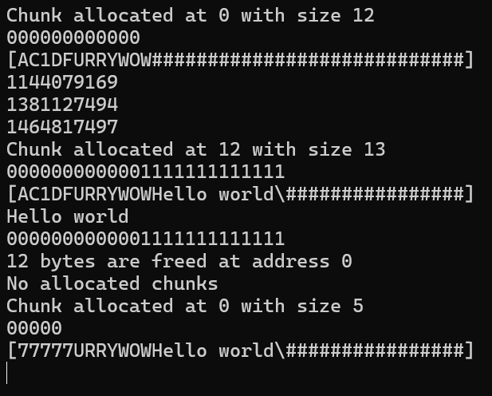
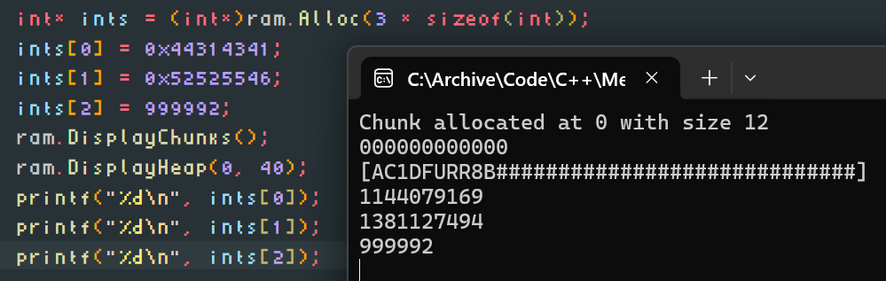

# C++ Stack Allocator

As my first memory-related project I wanted to mess around with the most important system there is: memory allocator. Heap is terrifying, so I made it entirely stack-based.

There is an unordered stack array of uninitialized chunks which is used for storing the chunks. Chunks form an always-sorted double-ended linked list of dynamic length. Every time a chunk is added or removed, the list is updated to stay sorted, allowing for iterating until finding a large enough free chunk.

Chunk represents a block of occupied (owned) stack memory in bytes. Address is an internal variable holding an index of the byte at the contents array. Size is length in bytes. Index is the index of the chunk object in the chunks array.

Whenever a new chunk is added, the index in the chunks array is attempted to be chosen using a stack (LIFO) of indecies of freed chunks. In such case the use of the chunks array has very little constant CPU overhead. The memory overhead is quite significant though, since chunk has a size of 32 bytes, and the total consumption on the default `MAX_CHUNKS` of `512` is a whopping 16KB.

```cpp
#include <iostream>
#include "meme.h"

Heap ram;

int main() {

	int* ints = (int*)ram.Alloc(3 * sizeof(int));
	ints[0] = 0x44314341; // 1144079169 <- D1CA
	ints[1] = 0x52525546; // 1381127494 <- RRUF
	ints[2] = 0x574F5759; // 1464817497 <- WOWY
	ram.DisplayChunks();
	ram.DisplayHeap(0, 40);
	printf("%d\n", ints[0]);
	printf("%d\n", ints[1]);
	printf("%d\n", ints[2]);
	char* const string = (char*)ram.Alloc(13);
	string[0] = 'H';
	string[1] = 'e';
	string[2] = 'l';
	string[3] = 'l';
	string[4] = 'o';
	string[5] = ' ';
	string[6] = 'w';
	string[7] = 'o';
	string[8] = 'r';
	string[9] = 'l';
	string[10] = 'd';
	string[11] = '\n';
	string[12] = '\0';
	ram.DisplayChunks();
	ram.DisplayHeap(0, 40);
	printf(string);
	ram.DisplayChunks();
	ram.Free(ints);
	ram.Free(string);
	ram.DisplayChunks();
	char* const other = (char*)ram.Alloc(5);
	other[0] = '7';
	other[1] = '7';
	other[2] = '7';
	other[3] = '7';
	other[4] = '7';
	ram.DisplayChunks();
	ram.DisplayHeap(0, 40);
	
	{
		int in;
		std::cin >> in;
	}
	
	return 0;
}
```

outputting





Features:
- Alloc
- Free
- Display (2 modes: contents and chunk IDs)

Todo:
- [x] alloc
- [x] free
- [x] display
- [ ] segmentation cleaner
- [ ] calloc
- [ ] memcpy
- [ ] memmove
- [ ] realloc
- [ ] length